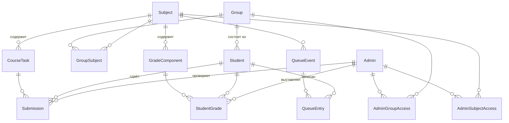

# Слой Domain

Ядро системы — чистые бизнес-сущности и перечисления. Никаких зависимостей от EF Core, Identity
или сторонних библиотек: учётные данные (email, пароль, роли) живут в Infrastructure и связаны
с доменными профилями общим первичным ключом.

Исходники: [`FunAndChecks.Domain`](../FunAndChecks.Domain).

## Пользователи: Student и Admin

Абстрактный базовый класс `User` хранит только общие поля; конкретные роли — отдельные сущности
(маппинг **TPC**: каждая в своей таблице, без общей таблицы Users).

| Сущность | Поля | Назначение |
|----------|------|-----------|
| `User` (abstract) | `Id`, `FirstName`, `LastName`, `FullName` (вычисляемое) | Общая база профиля |
| `Student` | + `GitHubUrl`, `Color`, `GroupId`/`Group`, коллекции `Submissions`, `QueueEntries`, `Grades` | Студент — сдаёт задания, стоит в очередях |
| `Admin` | + `Color`, `Letter` | Преподаватель — проверяет сдачи; `Color`/`Letter` подсвечивают его в таблице результатов |

- `Id` профиля **совпадает** с `Id` учётной записи (`ApplicationUser` в Infrastructure).
- `Student.Color` и `Admin.Color` — независимые hex-цвета (`#RRGGBB`). Цвет студента (если задан)
  заливает фон ячейки с его ФИО в сводной таблице результатов (null — без заливки); задаётся самим
  студентом или админом. Цвет/буква админа используются в ячейках задач таблицы результатов.

## Учебные сущности

| Сущность | Поля | Связи |
|----------|------|-------|
| `Group` | `Id`, `Name` | многие студенты; many-to-many с предметами через `GroupSubject` |
| `Subject` | `Id`, `Name` | задачи `CourseTask`, оценочные колонки `GradeComponent`, группы через `GroupSubject` |
| `CourseTask` | `Id`, `Name`, `Description`, `MaxPoints`, `SubjectId` | принадлежит предмету; имеет `Submissions` |
| `GroupSubject` | `GroupId`, `SubjectId` | связующая таблица «группа ↔ предмет» |

> Имя группы хранится как есть (формат `M8О-XYY-ZZ`); год/номер при необходимости разбираются
> на клиенте. Отдельных полей `StartYear`/`GroupNumber` в домене нет.

## Сдачи и оценки

Две независимые модели оценивания предмета:

1. **Задачи** (выполнил/не выполнил) — `CourseTask` + история попыток `Submission`.
2. **Глобальные оценки** (баллы) — `GradeComponent` (колонка «Билет», «Курсовая») + `StudentGrade`.

| Сущность | Поля | Примечание |
|----------|------|-----------|
| `Submission` | `Id`, `Status`, `Comment`, `SubmittedAt`, `StudentId`, `TaskId`, `AdminId`, `QueueEventId?` | Полная история всех попыток; актуальный статус задачи = статус последней по времени |
| `GradeComponent` | `Id`, `Name`, `MinPoints`, `MaxPoints`, `SubjectId` | Оценочная колонка предмета; диапазон `Min..Max` (напр. 2–5 для билета/курсовой) |
| `StudentGrade` | `Id`, `Points`, `Comment`, `UpdatedAt`, `GradeComponentId`, `StudentId`, `AdminId` | Баллы студента за колонку; на пару (колонка, студент) — не более одной записи (upsert) |

И принятые задачи (`MaxPoints`), и баллы за колонки суммируются в итоговый балл студента по предмету.

## Очереди

| Сущность | Поля | Связи |
|----------|------|-------|
| `QueueEvent` | `Id`, `Name`, `EventDateTime`, `AllowSelfJoin`, `SubjectId` | Событие сдачи по предмету; `AllowSelfJoin=false` — состав фиксирует админ (авто-очередь по группе) |
| `QueueEntry` | `Id`, `JoinedAt`, `Status`, `QueueEventId`, `StudentId`, `CurrentAdminId?` | Запись студента в очередь; кто сейчас проверяет |

## Видимость для админов

Настройки видимости предметов и групп для конкретного админа. Запись существует, только если
задействован хотя бы один флаг (иначе удаляется).

| Сущность | Поля | Смысл флагов |
|----------|------|--------------|
| `AdminSubjectAccess` | `AdminId`, `SubjectId`, `IsRestricted`, `IsHidden` | `IsRestricted` — глобальный запрет супер-админа (блокирует действия); `IsHidden` — локальное скрытие самим админом |
| `AdminGroupAccess` | `AdminId`, `GroupId`, `IsRestricted`, `IsHidden` | то же для групп |

## Перечисления

[`SubmissionStatus`](../FunAndChecks.Domain/Enums/SubmissionStatus.cs):

| Значение | Смысл |
|----------|-------|
| `NotSubmitted` | Не сдано (по умолчанию) |
| `Accepted` | Принято |
| `Rejected` | Не принято |

[`QueueEntryStatus`](../FunAndChecks.Domain/Enums/QueueEntryStatus.cs) — **порядок значений влияет на сортировку**:

| Значение | Смысл |
|----------|-------|
| `Checking` (0) | Проверяется прямо сейчас |
| `Waiting` (1) | Ожидает очереди |
| `Skipped` (2) | Пропущен |
| `Finished` (3) | Закончил сдачу |

## Роли

[`Roles`](../FunAndChecks.Domain/Constants/Roles.cs) — имена ролей нужны на всех слоях для авторизации:

| Константа | Значение | Кто |
|-----------|----------|-----|
| `Roles.Student` | `"User"` | Студент |
| `Roles.Admin` | `"Admin"` | Преподаватель |
| `Roles.SuperAdmin` | `"SuperAdmin"` | Супер-админ (управляет админами и ограничениями) |

## Схема связей

Маппинг сущностей на таблицы и поведение каскадов — в [docs/infrastructure.md](infrastructure.md#конфигурации-ef).
